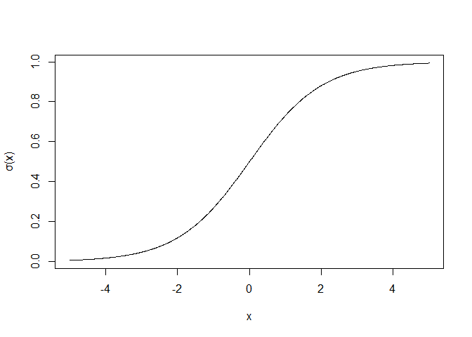
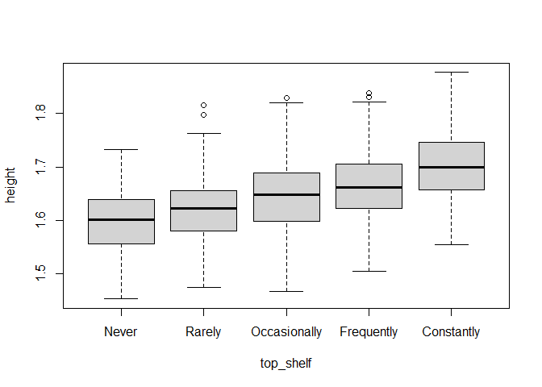
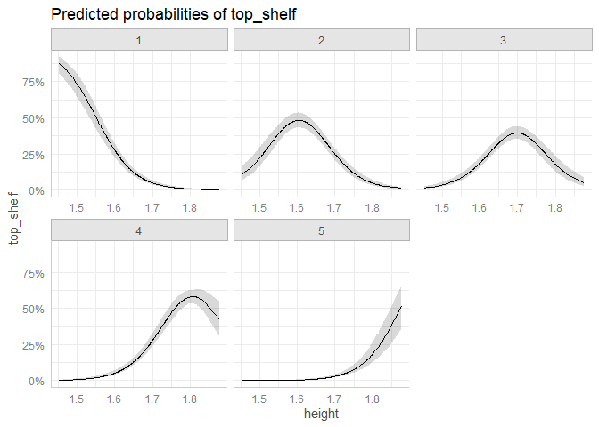
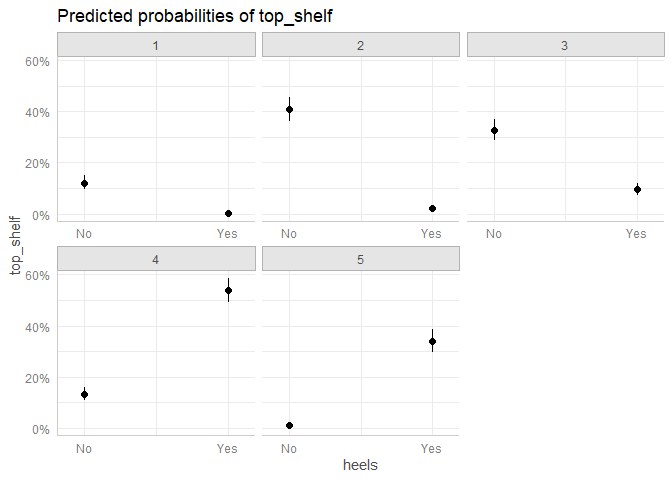
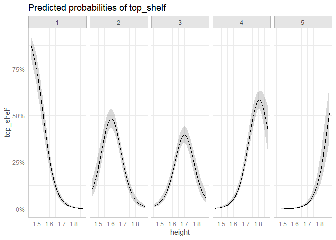
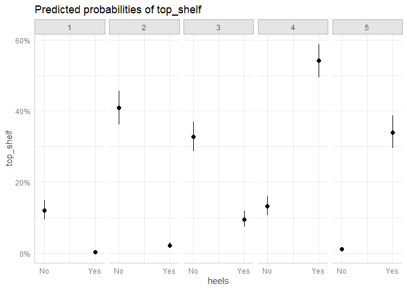
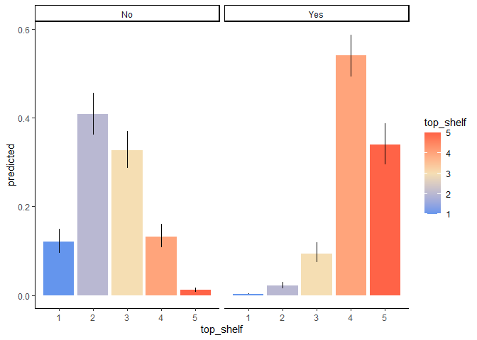
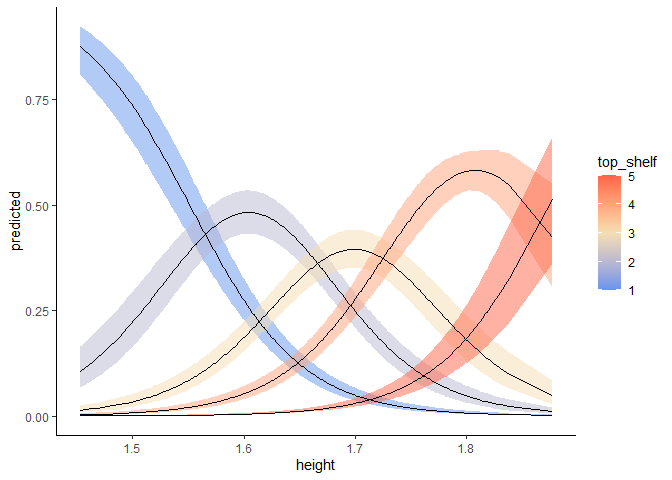

# Cumulative link models (CLMs)

TODO:

1.  Figure out any distributional assumptions: if you use logit models,
    are you assuming a logistically distributed latent variable? Probit
    models, normally distributed latent variable? There’s bound to be a
    question about this
2.  How do we decide whether to use structured thresholds?
3.  How can one plot CLMMs?
4.  What if one of the predictors is ordinal?

RTC Methods Club, February 20, 2025

Isaac Kinley & Sabrina Valenzano

## Introduction

We know how to deal with continuous response data (linear regression)
and binary data (logistic regression), but what about **ordinal data**?

Ordinal data consists of observations that fall into a series of
**ordered levels**. In other words, we know how to arrange the
observations in some order, but we don’t know anything about the
distances between levels. Importantly, even if the levels have numerical
*labels*, it’s still not appropriate to treat these as numerical
observations on a continuous scale.

A common example of ordinal data in psychology is Likert-scale survey
responses:

1.  Strongly disagree
2.  Somewhat disagree
3.  Neutral
4.  Somewhat agree
5.  Strongly agree

The wording is chosen so that successive levels seem roughly
psychologically equidistant, but we still can’t pretend we’re working
with numerical measurements on a continuous scale. In fact, we’re
working with *categorical* measurements on an *ordinal* scale, and
cumulative link models (CLMs) are appropriate for this type of data.

## Terminology

We’re using the term “CLM” today because it matches the name of the
`clm` function we’ll be using, but these models have many other names:

-   Ordinal regression
-   Proportional odds models
-   Ordered logit (or probit)

## CLMs vs logistic regression

To understand CLMs, it’s helpful to first review logistic regression. We
have some variable *Y* that can take on values 0 or 1, and we model the
probability that it takes on either value according to an intercept *θ*
a predictor variable or set of variables *x*, and a coefficient or set
of coefficients *β* that estimate the relationship between *x* and *Y*:

*P*(*Y* = 1) = *σ*(*θ* + *β**x*)

Here is how the logistic function *σ*(*x*) looks (it’s sometimes called
a “sigmoid” function because it’s S-shaped):

    x <- seq(-5, 5, l = 1000)
    plot(plogis(x) ~ x, ylab = 'σ(x)', type = 'l')

It’s helpful to think of CLMs as a series of logistic regressions. If
our observations *Y* fall into ordinal categories labeled 1, 2, 3, 4,
and 5 (as with a Likert-type scale), our model is as follows:

$$
P(Y \leq 1) = \sigma(\theta\_1 + \beta x) \\
P(Y \leq 2) = \sigma(\theta\_2 + \beta x) \\
P(Y \leq 3) = \sigma(\theta\_3 + \beta x) \\
P(Y \leq 4) = \sigma(\theta\_4 + \beta x) \\
P(Y \leq 5) = 1 \\
$$

I.e., we are modelling the probability that the observation is less than
or equal to 1, less than or equal to 2, etc., with a series of
intercepts *θ*1, *θ*2, etc. and a single set of
coefficients *β*. In CLM terminology, the *θ* variables are called
**thresholds**.

## CLM example

Let’s generate some imaginary data. Suppose we’ve measured people’s
heights, asked whether they wear high heels, and asked how often they
get recruited to grab things off the top shelf.

    set.seed(123) # So that we all have the same random data
    ndata <- 1000
    cont <- 1.65 + rnorm(ndata, sd = 0.07)
    categ_effs <- c('A' = 0.5, 'B' = 0.6)
    categ <- sample(names(categ_effs), ndata, replace = T)
    latent_var <- 0.5*cont + categ_effs[categ] + rnorm(100, sd = 0.05)
    data <- data.frame(
      height = cont,
      heels = factor(categ,
                         levels = c('A', 'B'),
                         labels = c('No', 'Yes')),
      top_shelf = cut(latent_var,
                      breaks = c(-Inf, quantile(latent_var,
                                                probs = c(0.1, 0.3, 0.5, 0.8)),
                                 Inf),
                      labels = c('Never',
                                 'Rarely',
                                 'Occasionally',
                                 'Frequently',
                                 'Constantly'))
    )
    head(data)

    ##     height heels    top_shelf
    ## 1 1.610767    No        Never
    ## 2 1.633888    No       Rarely
    ## 3 1.759110    No Occasionally
    ## 4 1.654936   Yes   Constantly
    ## 5 1.659050   Yes   Constantly
    ## 6 1.770055    No   Constantly

Let’s first visualize the association between height and
top-shelf-grabbing-recruitment:

    boxplot(height ~ top_shelf, data = data)

It might be tempting to run
`summary(lm(agreement ~ height, data = data))` and call it a day, this
would be pretending our Likert-scale responses constitute a numerical
measurement on a continuous scale, which they aren’t.

Take a look here when we try to fit a `lm` on ordinal data - we make the
false assumption of equal spacing between ordinal categories

    # # Convert agreement to numeric for plotting
    # agreement_numeric <- as.numeric(data$agreement)
    # 
    # # Fit linear model
    # lm_model <- lm(agreement_numeric ~ height, data = data)
    # 
    # # Plot regression line on raw ordinal data
    # plot(height, agreement_numeric, 
    #      xlab = "Height", ylab = "Agreement (Numeric)",
    #      main = "Linear Model Fit with Ordinal Data",
    #      pch = 16, col = "blue")+
    # # Add linear regression line
    # abline(lm_model, col = "red")

As you can see, the figure illustrates that the linear model does not
appropriately capture the structure of the ordinal data. The fitted
regression line does not align well with the categorical nature of the
outcome.

Instead, we’ll use the `clm` function from the `ordinal` package.
Although other packages, such as the `polr` function from the `MASS`
package, can estimate CLMs, the `ordinal` package provides additional
flexibility. Specifically, it allows for different link functions, the
estimation of partial proportional odds models, and the ability to
structure thresholds by specifying them as equidistant or symmetrical if
appropriate.

The `clm` function uses the same syntax (Wilkinson notation) as the
familiar `lm` function:

    library(ordinal)
    mod <- clm(top_shelf ~ height * heels, data = data)
    summary(mod)

    ## formula: top_shelf ~ height * heels
    ## data:    data
    ## 
    ##  link  threshold nobs logLik   AIC     niter max.grad cond.H 
    ##  logit flexible  1000 -1097.15 2208.29 6(0)  1.56e-10 3.5e+04
    ## 
    ## Coefficients:
    ##                 Estimate Std. Error z value Pr(>|z|)    
    ## height           19.9664     1.4087  14.173   <2e-16 ***
    ## heelsYes          2.9790     3.3479   0.890    0.374    
    ## height:heelsYes   0.4898     2.0335   0.241    0.810    
    ## ---
    ## Signif. codes:  0 '***' 0.001 '**' 0.01 '*' 0.05 '.' 0.1 ' ' 1
    ## 
    ## Threshold coefficients:
    ##                         Estimate Std. Error z value
    ## Never|Rarely              30.977      2.286   13.55
    ## Rarely|Occasionally       33.083      2.333   14.18
    ## Occasionally|Frequently   34.754      2.365   14.69
    ## Frequently|Constantly     37.419      2.384   15.69

This shows us that top shelf recruitment is indeed associated with
height and stiletto wearing, but no interaction. Notice that there are
only 4 “thresholds” or intercepts (*θ* in the above equations) even
though there are 5 categories. This is because the probability of the
observation being less than or equal to the highest category is always 1
(so the corresponding *θ* is always implicitly infinity).

## The proportional odds assumption

CLMs assume that the effect of the predictor variable (*β*) is
consistent across outcome categories, which is known as the
“proportional odds” assumption. In other words, we assume that what
changes across categories are the thresholds (*θ*) rather than the
predictor effects (*β*). We can test this assumption using the
`nominal_test` function, which compares a model with a single *β* across
all outcome categories to a model with a different *β* for each outcome
category:

    nominal_test(mod)

    ## Tests of nominal effects
    ## 
    ## formula: top_shelf ~ height * heels
    ##              Df  logLik    AIC    LRT Pr(>Chi)
    ## <none>          -1097.2 2208.3                
    ## height        3 -1096.2 2212.3 1.9755   0.5775
    ## heels         3 -1096.2 2212.5 1.8254   0.6094
    ## height:heels  6 -1094.8 2215.6 4.6538   0.5889

If we had gotten a significant *p* value for any of the rows in the
above table, it would mean that a model with varying *β* coefficients
for the corresponding variable/interaction provided a better fit, and
thus that the proportional odds assumption was violated.

Suppose the proportional odds assumption was violated for the `heels`
term. In this case, we could fit a **partial proportional odds** model,
where *β* is allowed to vary across categories for `heels`, making it a
“nominal effect”. This is done using the `nominal` argument to `clm`:

    mod.ppo <- clm(top_shelf ~ heels + height:heels, nominal = ~ height, data = data)
    summary(mod.ppo)

    ## formula: top_shelf ~ heels + height:heels
    ## nominal: ~height
    ## data:    data
    ## 
    ##  link  threshold nobs logLik   AIC     niter max.grad cond.H 
    ##  logit flexible  1000 -1096.16 2212.32 6(0)  5.80e-10 3.0e+04
    ## 
    ## Coefficients: (1 not defined because of singularities)
    ##                 Estimate Std. Error z value Pr(>|z|)
    ## heelsYes          4.6365     3.5977   1.289    0.197
    ## heelsNo:height    0.4945     2.1794   0.227    0.820
    ## heelsYes:height       NA         NA      NA       NA
    ## 
    ## Threshold coefficients:
    ##                                     Estimate Std. Error z value
    ## Never|Rarely.(Intercept)              27.301      3.483   7.838
    ## Rarely|Occasionally.(Intercept)       33.379      2.906  11.487
    ## Occasionally|Frequently.(Intercept)   36.400      2.995  12.155
    ## Frequently|Constantly.(Intercept)     40.183      3.751  10.713
    ## Never|Rarely.height                  -17.176      2.829  -6.071
    ## Rarely|Occasionally.height           -19.632      2.105  -9.325
    ## Occasionally|Frequently.height       -20.446      1.866 -10.956
    ## Frequently|Constantly.height         -21.112      1.986 -10.633

Notice that now we have 8 threshold coefficients: 4 *θ* intercepts and 4
*β* coefficients. If we compare the fit of this model to the previous
model, we get one of the rows output by `nominal_test`:

    anova(mod.ppo, mod)

    ## Likelihood ratio tests of cumulative link models:
    ##  
    ##         formula:                         nominal: link: threshold:
    ## mod     top_shelf ~ height * heels       ~1       logit flexible  
    ## mod.ppo top_shelf ~ heels + height:heels ~height  logit flexible  
    ## 
    ##         no.par    AIC  logLik LR.stat df Pr(>Chisq)
    ## mod          7 2208.3 -1097.1                      
    ## mod.ppo     10 2212.3 -1096.2  1.9755  3     0.5775

## Link functions and latent variables

## Plotting CLMs

Visualizing the associations between our predictors and our ordinal
outcome variable is straightforward with the `ggeffects` library. This
library has a function called `ggpredict` that allows us to predict and
then plot the probabilities of each ordinal response level for the
different levels of our predictors. To see how it works, we’ll first
import the necessary libraries:

    library(ggplot2)
    library(ggeffects)

### Visualizing continuous predictors

`ggpredict` takes an argument called `terms` that specifies which
predictors we’re interested in. For continuous predictors, it’s a good
idea to add `[all]` so that predictions are generated for many values of
the continuous predictor and the plot looks smooth:

    preds_con <- ggpredict(mod, terms = c("height [all]"))
    plot(preds_con)

It’s tempting to interpret these as probability distributions, but they
aren’t—the areas under the curves don’t have to sum to 1. In other
words, the probabilities on the y-axes represent the probability of the
response level given the predictor level, rather than the probability of
the predictor level given the response level. Later, we’ll create a
custom plot that makes this difference clear.

### Categorical predictors

The syntax for plotting categorical predictors is basically the same,
except that it’s not necessary to add `[all]` after the name of the
predictor:

    # Generate predicted probabilities
    preds_cat <- ggpredict(mod, terms = c("heels"))
    plot(preds_cat)

For each of these, if we wanted to make sure all of the subplots
(“facets” in ggplot terminology) are on the same line, we could add
`+ facet_wrap(~response.level, nrow = 1)`:

    plot(preds_con) + facet_wrap(~response.level, nrow = 1)

    plot(preds_cat) + facet_wrap(~response.level, nrow = 1)

### Customizing graphs

So far, we’ve just used a simple call to `plot()`, but this doesn’t give
us much control over how the plot is rendered (e.g., which variable is
represented by which aspect of the plot). For greater control, we can
convert the output of `ggpredict` to a `data.frame` object that we then
pass to `ggplot`:

    preds <- ggpredict(mod, terms = c("heels"))
    df <- as.data.frame(preds,
                        terms_to_colnames = T) # This is important to include! Otherwise the column names won't correspond to your variable names
    head(df)

    ##   heels   predicted    conf.low   conf.high top_shelf group
    ## 1    No 0.120267685 0.095840751 0.149888240         1     1
    ## 2    No 0.408614819 0.362366023 0.456540046         2     1
    ## 3    No 0.327679854 0.287539137 0.370510097         3     1
    ## 4    No 0.131910919 0.107661138 0.160639479         4     1
    ## 5    No 0.011526723 0.008106962 0.016365241         5     1
    ## 6   Yes 0.003086542 0.002038146 0.004671694         1     1

As we can see, we have a different row for each combination of predictor
variable level and response variable level, along with the predicted
probability of the response given the predictor, and the upper and lower
boundaries of the confidence interval (95% by default). We can use this
info to create any kind of plot we want:

    ggplot(df, aes(y = predicted, x = top_shelf, fill = top_shelf)) +
      geom_col(position = position_dodge()) +
      geom_errorbar(aes(ymin = conf.low, ymax = conf.high),
                    width = 0) +
      facet_wrap(~heels, nrow = 1) +
      scale_fill_gradientn(colours = c('cornflowerblue', 'wheat', 'tomato')) +
      theme_classic()

We can do the same thing for continuous predictors:

    preds <- ggpredict(mod, terms = c("height [all]"))
    df <- as.data.frame(preds,
                        terms_to_colnames = T) # This is important to include!
    ggplot(df, aes(x = height, y = predicted, group = top_shelf)) +
      geom_ribbon(aes(ymin = conf.low, ymax = conf.high, fill = top_shelf),
                  alpha = 0.5) +
      geom_line() +
      scale_fill_gradientn(colours = c('cornflowerblue', 'wheat', 'tomato')) +
      theme_classic()

This makes it clear what these plots actually represent: each line isn’t
a probability distribution, but rather, they track the rise and fall in
likelihood of each response category across the values of a predictor
variable.

## Mixed effects CLMs (CLMMs)

Mixed effects models (AKA mutlilevel/hierarchical/random-effects models)
allow us to analyze repeated-measures data without averaging multiple
observations together and thereby losing power. In psychology, mixed
effects models are often applied when multiple measurements are made
from the same participants. Cumulative link mixed effects models (CLMMs)
allow us to apply this type of analysis to ordinal data.

Mixed effects models allow us to account for any number of normally
distributed “random effects” in our data. In psychology, this usually
means accounting for the fact that measurements from the same
participant are not independent. The equations underlying CLMMs are the
same as those underlying CLMs, except that random effects are
incorporated. In our case:

$$ P(Y \leq 1) = \sigma\left( \theta\_1 + \beta x + u\right) \\ P(Y \leq 2) = \sigma\left( \theta\_2 + \beta x + u\right) \\ \text{etc.} $$

where *u* is a random variable representing, e.g., a particular
participant’s random intercept. This means that the thresholds are
shared across participants. Whereas before we drew an analogy between
logistic regression and CLMs, here we can draw an analogy between
mixed-effects logistic regression and CLMMs (indeed, when an ordinal
variable has only two levels, the CLMMs and mixed-effects logistic
regression yield equivalent results; Bousquet, 2021).

    set.seed(123)
    n_ptpts <- 20
    n_obs_per <- 5
    ptpt_dfs <- list()
    for (ptpt_n in seq_len(n_ptpts)) {
      ptpt_intercept <- rnorm(1)
      cont <- rnorm(n_obs_per)
      ptpt_dfs[[ptpt_n]] <- data.frame(
        ptpt = ptpt_n,
        cont = cont,
        latent_var = cont + ptpt_intercept + rnorm(n_obs_per, 2)
      ) 
    } 
    data <- do.call(rbind, ptpt_dfs)
    data$agreement = cut(data$latent_var,
                         breaks = c(-Inf, quantile(data$latent_var,
                                                   probs = c(0.1, 0.2, 0.4, 0.8)),
                                    Inf),
                         labels = c('Strongly disagree',
                                    'Disagree',
                                    'Neutral',
                                    'Agree',
                                    'Strongly agree'))
    head(data)

    ##   ptpt        cont latent_var      agreement
    ## 1    1 -0.23017749  1.6702631          Agree
    ## 2    1  1.55870831  1.7331714          Agree
    ## 3    1  0.07050839  0.8231799        Neutral
    ## 4    1  0.12928774  1.1231501        Neutral
    ## 5    1  1.71506499  4.3786711 Strongly agree
    ## 6    2  0.40077145  0.7939681        Neutral

To fit a CLMM to this data, we just need to add the term `(1|ptpt)` to
specify that we want a random intercept for each participant. This is
the same syntax as the `lmer` function from the `lme4` package:

    mod <- clmm(agreement ~ cont + (1|ptpt), data = data)
    summary(mod)

    ## Cumulative Link Mixed Model fitted with the Laplace approximation
    ## 
    ## formula: agreement ~ cont + (1 | ptpt)
    ## data:    data
    ## 
    ##  link  threshold nobs logLik  AIC    niter    max.grad cond.H 
    ##  logit flexible  100  -120.63 253.26 284(854) 2.11e-05 1.1e+01
    ## 
    ## Random effects:
    ##  Groups Name        Variance Std.Dev.
    ##  ptpt   (Intercept) 0.8875   0.9421  
    ## Number of groups:  ptpt 20 
    ## 
    ## Coefficients:
    ##      Estimate Std. Error z value Pr(>|z|)    
    ## cont   1.8513     0.3006   6.158 7.36e-10 ***
    ## ---
    ## Signif. codes:  0 '***' 0.001 '**' 0.01 '*' 0.05 '.' 0.1 ' ' 1
    ## 
    ## Threshold coefficients:
    ##                            Estimate Std. Error z value
    ## Strongly disagree|Disagree  -3.2939     0.5222  -6.308
    ## Disagree|Neutral            -2.0395     0.4086  -4.991
    ## Neutral|Agree               -0.4244     0.3349  -1.267
    ## Agree|Strongly agree         2.3847     0.4268   5.588
